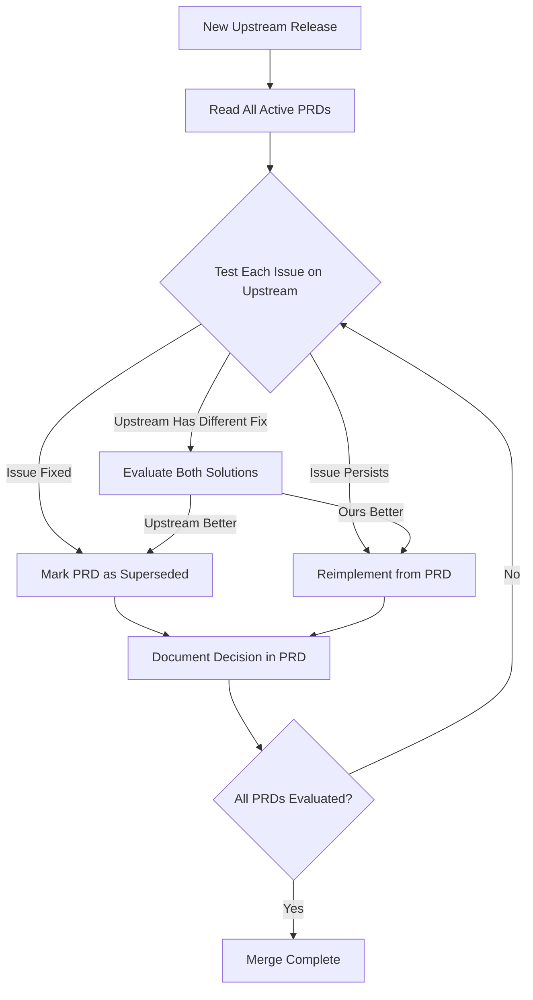

# Epic: Manage & Keep Us Upgradable

**Epic ID**: Epic-manage-keep-us-upgradable
**Status**: Active
**Priority**: Critical
**Created**: 2026-02-18
**Owner**: Engineering Team

---

## 🎯 Epic Goal

Establish a sustainable process for maintaining our aider-desk fork that enables us to:
1. **Stay current** with upstream releases
2. **Preserve business-critical features** we've developed
3. **Minimize merge conflicts** and technical debt
4. **Document institutional knowledge** for long-term maintainability

---

## 📋 Problem Statement

During Epic 5 (HomeKit Integration), we implemented 7 critical enhancements to aider-desk:
- Performance improvements (CPU optimization, IPC handling)
- Multi-agent orchestration features (profile lookup, task initialization)
- Tool integration fixes (Ollama + Aider compatibility)
- Test infrastructure improvements

**Current Challenge:**
- Upstream is 20+ commits ahead
- Direct merge creates conflicts in `task.ts` and `types.ts`
- Risk of losing our enhancements if we blindly accept upstream changes
- No systematic way to evaluate "do we still need our changes?"

---

## 💡 Strategic Approach: PRD-Documented Feature Preservation

### Core Philosophy

**Upstream-First with Documented Divergence**

Instead of maintaining a permanent fork with merge conflicts, we:
1. **Document each feature** as a Product Requirements Document (PRD)
2. **Test upstream** before each merge to see if they've solved our problems
3. **Selectively reimplement** only features that remain necessary
4. **Adopt upstream solutions** when they're better than ours

### Why PRD-First Beats Other Approaches

| Approach | Merge Strategy | Knowledge Capture | Future Merge Cost | Upstream Bias |
|----------|----------------|-------------------|-------------------|---------------|
| **Option A: Rebase** | Linear history | Commit messages | High (conflicts) | Medium |
| **Option B: Merge** | Merge commits | Commit messages | High (conflicts) | Medium |
| **Option C: TDD Reimplement** | Clean branches | Tests + code | Medium (reimplement all) | Medium |
| **Option D: PRD-First** ⭐ | Clean branches | PRDs + tests + code | **Low** (reimplement only needed) | **Strong** |

---

## 📊 Key Metrics

### Success Criteria
- ✅ All 7 features documented as PRDs within 2 weeks
- ✅ Upstream merge completed with zero unresolved conflicts
- ✅ Business-critical features preserved (5+ of 7)
- ✅ Future merges take <6 hours (vs 12-16 hours with rebase)
- ✅ New team members can understand fork rationale in <1 hour

### Time Investment
- **Phase 1: PRD Writing**: 8-12 hours (one-time)
- **Phase 2: Initial Reimplement**: 4-8 hours (first merge)
- **Ongoing: Future Merges**: 4-6 hours each (recurring)

**ROI**: After 2 upstream merges, PRD approach saves 16+ hours vs traditional rebase

---

## 🗂️ PRD Inventory

### PRD Numbering Scheme
PRDs use incremental numbering by 10s to allow for insertions:
- **0010**: Token Count Debouncing
- **0020**: Agent Profile Name Lookup
- **0030**: Profile-Aware Task Initialization
- **0040**: Task Tool Clarity
- **0050**: Ollama Aider Prefix Fix
- **0060**: IPC Max Listeners
- **0070**: Test Infrastructure (localStorage)

### PRD Lifecycle States
- **Active**: Feature is implemented and maintained
- **Under Review**: Being re-evaluated against upstream
- **Superseded**: Upstream has better solution, ours deprecated
- **Merged Upstream**: Our feature accepted into upstream repo

---

## 🔄 Process Workflow

### Every Upstream Merge

### PRD Maintenance Cadence

1. **Before Each Merge** (30 min):
   - Review all Active PRDs
   - Identify which issues to test

2. **During Merge** (2-4 hours):
   - Test upstream for each PRD
   - Reimplement only necessary features
   - Update PRD status

3. **After Merge** (30 min):
   - Document decisions in PRD Decision Log
   - Update MERGE_STRATEGY_COMPARISON.md
   - Commit PRD updates

---

## 🎯 Strategic Advantages

### 1. Upstream-First Philosophy ✅
Before reimplementing, we ask: "Has upstream solved this?" This keeps us aligned and reduces fork divergence.

### 2. Evolutionary Solutions ✅
If upstream adds their own fix, we can evaluate and adopt theirs if superior.

### 3. Institutional Knowledge ✅
New developers read PRDs to understand "why we forked" with full business context.

### 4. Selective Re-Implementation ✅
Only port 2-4 features per merge instead of all 7, saving significant time.

### 5. Collaboration Potential ✅
Well-documented PRDs can be shared with upstream maintainers as feature proposals.

---

## 📅 Implementation Roadmap

### Phase 1: Foundation (Week 1)
- ✅ Create PRD template
- ✅ Write PRD-0010 (Token Count Debouncing) as example
- ⏳ Write remaining 6 PRDs
- ⏳ Review and validate PRD quality

### Phase 2: First Merge Execution (Week 2)
- ⏳ Test all 7 issues on `sync/upstream-2026-02-17` branch
- ⏳ Reimplement necessary features
- ⏳ Update PRD statuses
- ⏳ Merge upstream successfully

### Phase 3: Validation (Week 3)
- ⏳ Run full test suite
- ⏳ Manual validation of preserved features
- ⏳ Document lessons learned

### Ongoing: Maintenance Mode
- Monitor upstream releases
- Quarterly PRD review (even without merges)
- Update PRDs as business priorities change

---

## 🔗 Related Documents

- [PRD Template](../../prds/0000-PRD-TEMPLATE.md)
- [PRD Strategy (Original)](./strategey.md)
- [Merge Strategy Comparison](../../MERGE_STRATEGY_COMPARISON.md)
- [Original PR Strategy](../../AIDER_DESK_PR_STRATEGY.md)
- [Original PR Plan](../../AIDER_DESK_PR_Plan.md)

---

## 🎓 Key Learnings & Principles

### Principle 1: Document Why, Not Just What
Code and tests show "what" and "how". PRDs capture the critical "why" that guides future decisions.

### Principle 2: Bias Toward Upstream
Our fork exists to enable rapid iteration, not to permanently diverge. Always prefer upstream solutions when equivalent.

### Principle 3: Business Value Over Technical Elegance
A feature with clear business impact (40% fewer orchestration failures) justifies maintenance cost. Nice-to-haves don't.

### Principle 4: Knowledge = Asset
Well-documented PRDs are as valuable as the code itself. They enable faster onboarding and better decision-making.

---

## 📊 Measuring Success

### Quantitative Metrics
- Time to complete upstream merge: Target <6 hours
- Number of features reimplemented: Target <50% of PRDs
- Test pass rate after merge: Target 100%
- PR review cycles (if contributing upstream): Target <3 cycles

### Qualitative Metrics
- Team confidence in merge process: Survey score >4/5
- Upstream maintainer receptiveness: Positive feedback on shared PRDs
- New developer onboarding time: <2 hours to understand fork rationale

---

## 🚀 Next Actions

1. ✅ Create PRD template in `knowledge_base/prds/0000-PRD-TEMPLATE.md`
2. ✅ Write PRD-0010 (Token Count Debouncing) as working example
3. ⏳ Schedule PRD writing sessions for remaining 6 features
4. ⏳ Update merge strategy doc with PRD-based workflow
5. ⏳ Execute first upstream merge using PRD process

---

## 📝 Notes

- This epic represents a shift in fork management philosophy from "maintain divergence" to "document and selectively preserve"
- Success depends on discipline: PRDs must be kept up-to-date or they lose value
- Consider automation: Scripts to test PRD issues against upstream could reduce evaluation time
- Future enhancement: Create GitHub Actions workflow to auto-check PRD issues on new upstream releases

---

**Last Updated**: 2026-02-18
**Next Review**: After first upstream merge completion
